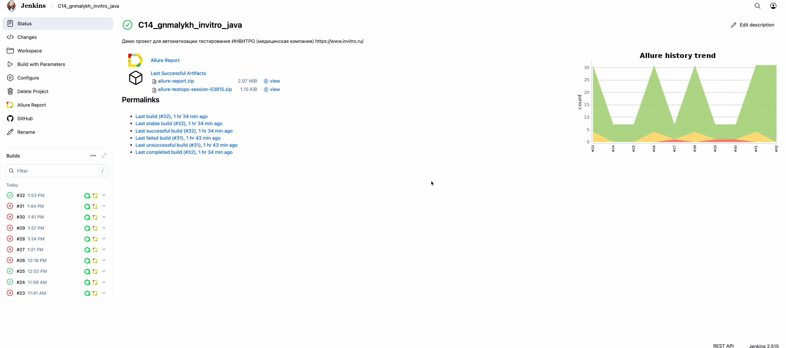
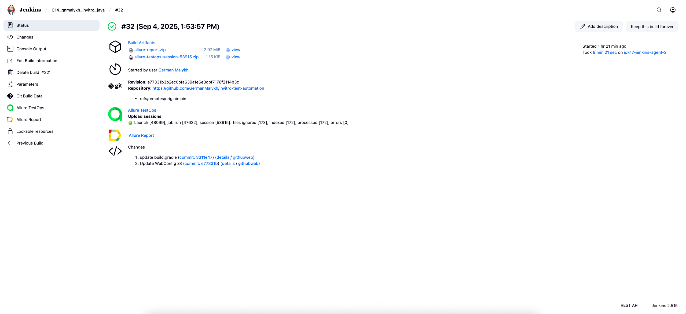
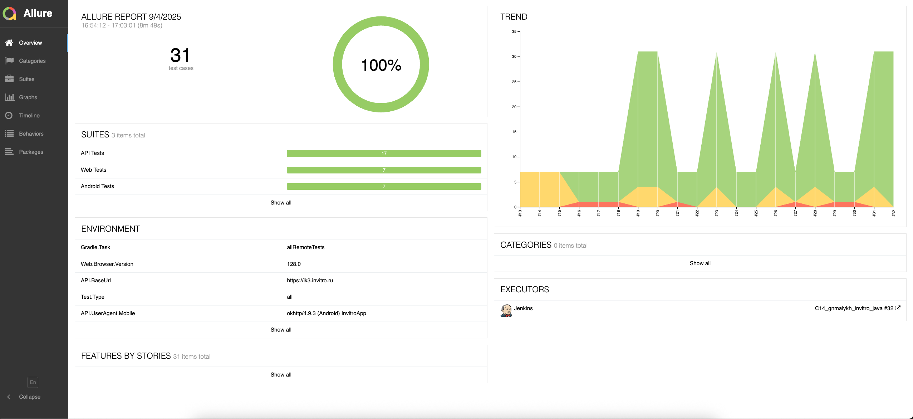
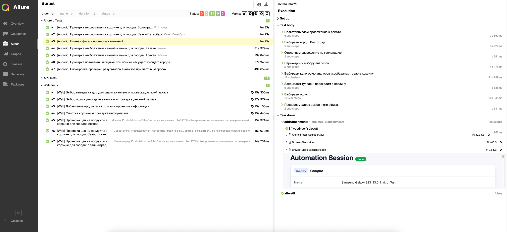
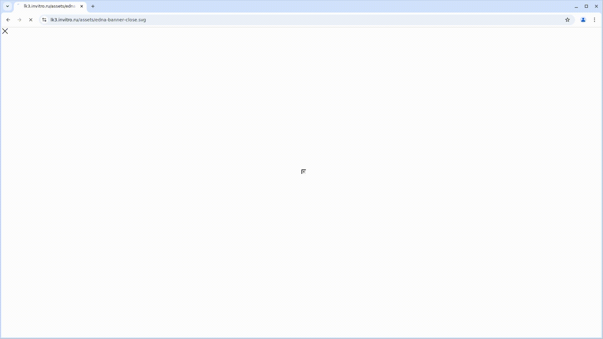
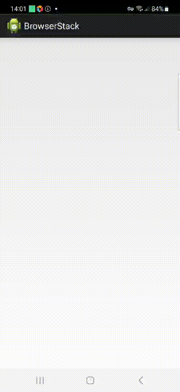
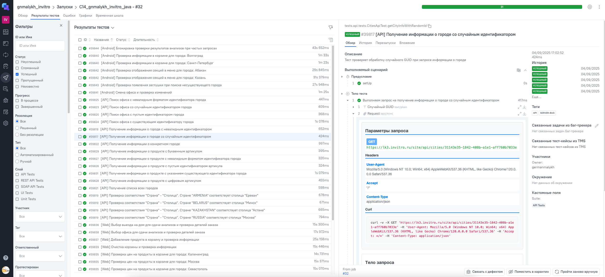
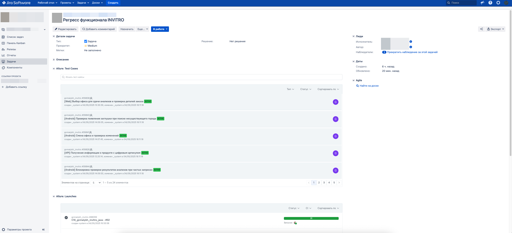
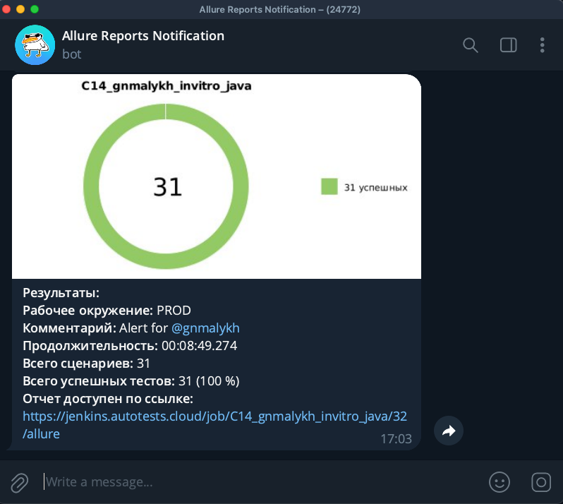

# Демо-проект для автоматизации сервиса медицинских услуг [_INVITRO_](https://www.invitro.ru/)

<p align="left">
  
</p>

> **Invitro** — крупнейшая в России частная медицинская компания, предоставляющая услуги лабораторной диагностики, анализов и других медицинских исследований.

---

# <a name="Описание">Описание</a>

Тестовый проект состоит из WEB-тестов, API-тестов и тестов для мобильного устройства на базе (Android).\
Краткий список интересных фактов о проекте:

- [x] В проекте применён шаблон проектирования `Page Object`
- [x] В проекте используются параметризованные тесты
- [x] Использован `Lombok` для описания моделей API запросов/ответов
- [x] Добавлен кастомный `Allure listener` для визуализации запросов/ответов API в отчёте
- [x] Тесты запускаются в `Jenkins` с выбранными параметрами
- [x] Интеграция с `Allure TestOps`
- [x] Интеграция с `Jira`
- [x] Итоги запуска тестов приходят в `Telegram`

# <a name="Технологии и инструменты">Используемые технологии и инструменты</a>

<p  align="center">
  <code></code>
  <code></code>
  <code></code>
  <code></code>
  <code></code>
  <code></code>
  <code></code>
  <code></code><br>
  <code></code>
  <code></code>
  <code></code>
  <code></code>
  <code></code>
  <code></code>
  <code></code>
  <code></code>
</p>
<br>


Автотесты в проекте написаны на `Java`.

`Gradle` - используется, как инструмент для сборки проекта.\
`JUnit5` - используется для запуска тестов.\
`Selenide` - используется для автоматизации UI WEB.\
`REST Assured` - используется для тестирования API сервисов REST.\
`Jenkins` - используется для удаленного запуска тестов.\
`Selenoid` - используется для удаленного запуска браузера в `Docker` контейнере.\
`BrowserStack` - используется для удаленного запуска мобильных тестов.\
`Android Studio Tools`, `Appium Server` - используются для локального запуска мобильных тестов.\
`Allure Report` - используется для визуализации отчета о тестировании.\
`Telegram Bot` - используется для уведомления о результатах прогона тестов.\
`Allure TestOps` - используется, как репозиторий для хранения тестов.

---

# <a name="Как запустить">Как запустить тесты</a>

## <a name="GradleCommand">Gradle команды</a>

### Запуск отдельных типов тестов

Для запуска локально и удаленно используется следующая команда:

```bash
gradle clean ${GRADLE_TASK}
```

В `GRADLE_TASK` представлен список задач:
> - allRemoteTests      - для запуска всех тестов удаленно (исключая only-local-ru-ip)
> - allLocalTests       - для запуска всех тестов локально
> - androidRemoteTests  - для запуска Android тестов удаленно
> - androidLocalTests   - для запуска Android тестов локально
> - webRemoteTests      - для запуска Web тестов удаленно
> - webLocalTests       - для запуска Web тестов локально
> - apiLocalTests       - для API тестов локально
> - apiRemoteTests      - для API тестов удаленно (исключая only-local-ru-ip)


## <a name="Конфигурационные файлы">Конфигурационные файлы</a>

Конфигурации окружения для тестов описаны в файлах `*.properties` в папке `configs/`.\
Значения параметров зависят от типа тестов и среды запуска.

### Web тесты (`configs/web/remote.properties`)
```properties
browser_name=...
browser_version=...
browser_size=...
selenoid_url=...
env=...
```

### Mobile тесты (`configs/mobile/remote.properties`)
```properties
app=...
device=...
os_version=...
browserstack.user=...
browserstack.key=...
env=...
```

> - *browser_name* - Имя запускаемого браузера
>- *browser_version* - Версия запускаемого браузера  
>- *browser_size* - Разрешение браузера
>- *selenoid_url* - URL для удалённого запуска в Selenoid
>- *app* - Путь к APK файлу приложения
>- *device* - Название устройства для тестирования
>- *os_version* - Версия операционной системы
>- *browserstack.user/key* - Данные для доступа к BrowserStack

---

## <a name="Запуск в Jenkins">Запуск тестов в [Jenkins](https://jenkins.autotests.cloud/job/C14_gnmalykh_invitro_java/)</a>

> _Ссылка доступна только авторизованным пользователям._

Главная страница сборки:
<p  align="center">

</p>

Параметризованный запуск тестов в Jenkins можно выполнить с указанной категорией тестов из списка **GRADLE_TASK**:

> - apiRemoteTests - Запускает API тесты
>- webRemoteTests - Запускает Web тесты
>- androidRemoteTests - Запускает Android тесты
>- allRemoteTests - Запускает API/Web/Android тесты
<p  align="center">

</p>

После завершения сборки результаты тестирования доступны в:
<code><strong>*Allure Report*</strong></code> или в сообщении от <code><strong>*Telegram-бота*</strong></code>

<p  align="center">

</p>

---

# <a name="AllureReport">Результаты автотестов в [Allure Report](https://jenkins.autotests.cloud/job/C14_gnmalykh_invitro_java/allure/)</a>

> _Ссылка доступна только авторизованным пользователям._

# <a name="AllureReportAlternative">Альтернативная ссылка на пример [Allure отчета](https://germanmalykh.github.io/invitro-test-automation/)</a>
> _Доступно без авторизации_

В отчете для каждого теста отображается подробная информация с выполненными шагами.\
Также доступны дополнительные тестовые артефакты: скриншоты, видео, визуализация API запросов и т.д.

<p align="center">
  
</p>

<p align="center">
  
</p>

### Запись теста для WEB
<p  align="center">

</p><br>

### Запись теста для Android
<p  align="center">

</p><br>

---
# <a name="AllureTestOps">Интеграция с [Allure TestOps](https://allure.autotests.cloud/project/4906/dashboards)</a>

> _Ссылка доступна только авторизованным пользователям._

Тест-кейсы в проект импортируются и постоянно обновляются из кода,
поэтому нет необходимости в сложном процессе синхронизации ручных тест-кейсов и автотестов.\
Достаточно создать и обновить в коде автотест, и тест-кейс в TMS всегда будет в актуальном состоянии.\
Ручные тест-кейсы также могут быть добавлены в TMS в случае необходимости (через веб-интерфейс или через код).
<p align="center">
  
</p>

# <a name="Jira">Интеграция с [Jira](https://jira.autotests.cloud/browse/HOMEWORK-1493)</a>

> _Ссылка доступна только авторизованным пользователям._

Результаты прогона тестов отображаются в `Jira` с отображением статуса теста и возможность просмотра его деталей.\
Так же из задачи в `Jira` доступна навигация к тестам `Allure TestOps`.
<p align="center">
  
</p>


---

# <a name="Уведомления в Telegram">Интеграция с [Telegram-ботом](https://t.me/gm_allure_not_bot)</a>

Telegram-бот отправляет краткий отчет в указанный чат по результатам каждой сборки.
<p  align="center">

</p>